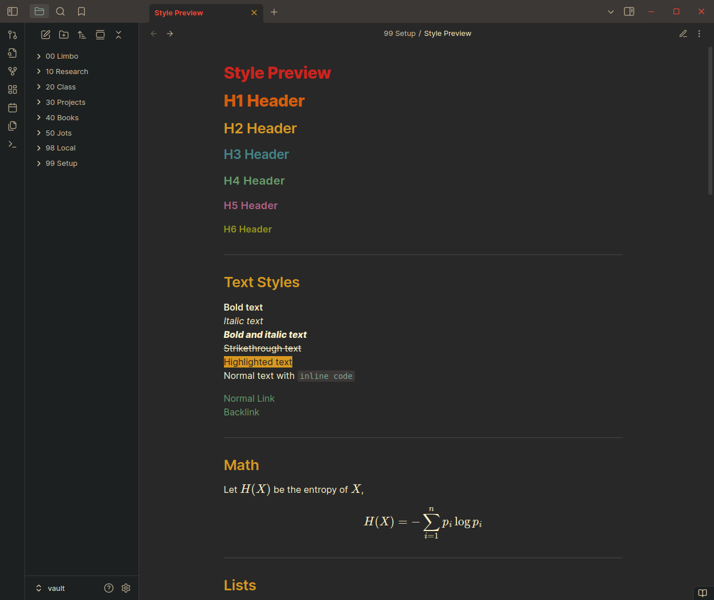

# Note-taking with Obsidian Git

## Setup

1. Create a new, empty repository on GitHub.
2. Clone the repository and open it as a vault in obsidian
3. Add the [Obsidian Git](https://github.com/Vinzent03/obsidian-git) plugin and configure the settings.
4. Add a `.gitignore` with the following,
```
.obsidian/plugins
.obsidian/types.json
.obsidian/core-plugins.json
.obsidian/community-plugins.json
.obsidian/workspace.json
```

Plugin-related files are ignored [per the documentation](https://publish.obsidian.md/git-doc/Tips-and-Tricks#Gitignore). Note that folders like `.obsidian/themes` and `.obsidian/snippets` are not ignored. This allows cosmetic changes to sync. 

5. Use `CTRL/CMD + P` to pull up the command palette and select `Git: Commit-and-sync` to push all the changes.

To set up the vault on another machine, just repeat steps 2 and 3. The rest of the settings (themes, snippets, editor, etc.) should sync.

## My config

For the Obsidian Git plugin,

- Auto commit-and-sync interval: 30
- Auto commit-and-sync after latest commit: on
- List file names affected by commit in the commit body: on
- Pull on startup: on
- Show status bar: off
- Show branch status bar: off

For themes, I use [Obsidian Gruvbox](https://github.com/insanum/obsidian_gruvbox) and [apply custom CSS styling via snippets](https://help.obsidian.md/snippets). Some useful snippets I have found are,
```
--h1-color: var(--neutral-orange); # change header colors
.MJX-TEX { font-size:135%; } # increase MathJax font size
```
[This forum thread on modifying bullets](https://forum.obsidian.md/t/problems-encountered-when-modifying-unordered-lists-styles-with-css/53824/3)

To preview these changes, I use [Syle Preview.md](<Style Preview.md>).



> [!note]
> This configuration was inspired by [this youtube video](https://www.youtube.com/watch?v=fVMlUd9orf4)

## Other plugins

- [Spellcheck Toggler](https://github.com/julzerinos/spellcheck-toggler-obsidian-plugin)
- [Desmos](https://github.com/Nigecat/obsidian-desmos)
- [Open Link With](https://github.com/MamoruDS/obsidian-open-link-with)