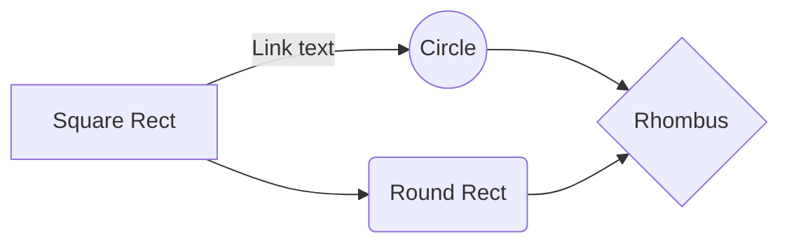

# H1 Header
## H2 Header
### H3 Header
#### H4 Header
##### H5 Header
###### H6 Header

---

## Text Styles

**Bold text**  
*Italic text*  
***Bold and italic text***  
~~Strikethrough text~~  
==Highlighted text==  
Normal text with `inline code`

[Normal Link](#math)
[[Backlink]]

---

## Math

Let $H(X)$ be the entropy of $X$,
$$
H(X) = -\sum_{i=1}^{n} p_i \log p_i
$$

---

## Lists

### Unordered List
- First level
  - Second level
    - Third level
	    - Fourth level

### Ordered List
1. First item
2. Second item
    1. Sub-item
    2. Sub-item

### Checkboxes
- [x] Checked item
- [ ] Unchecked item

---

## Code Blocks

```bash
git add src/
git commit -m "update src"
git push origin dev
```

```python
import torch

device = torch.device('cuda' if torch.cuda.is_available() else 'cpu')
print(f"Using device: {device}")
```

```cpp
#include <Eigen/Dense>
#include <Eigen/Geometry>

Eigen::Quaterniond q = Eigen::AngleAxisd(M_PI/4, Eigen::Vector3d::UnitZ());
Eigen::Matrix3d R = q.toRotationMatrix();
Eigen::Vector3d point = R * Eigen::Vector3d(1.0, 0.0, 0.0);
```

---

## Callouts

> [!note] Note
> This is a note callout block.

> [!info] Info
> This is an info callout block.

> [!success] Success
> This is a success callout block.

> [!warning] Warning
> This is a warning callout block.

> [!error] Error
> This is an error callout block.

> [!example] Example
> This is an example callout block.

> [!quote] Quote
> This is a quote callout block.

---

## Tags

#example-tag #nested/tag

---

## Tables

| Column 1 | Column 2 | Column 3 |
|----------|----------|----------|
| Row 1    | Data A   | Data B   |
| Row 2    | Data C   | Data D   |
| Row 3    | Data E   | Data F   |

---

## Mermaid Diagram


